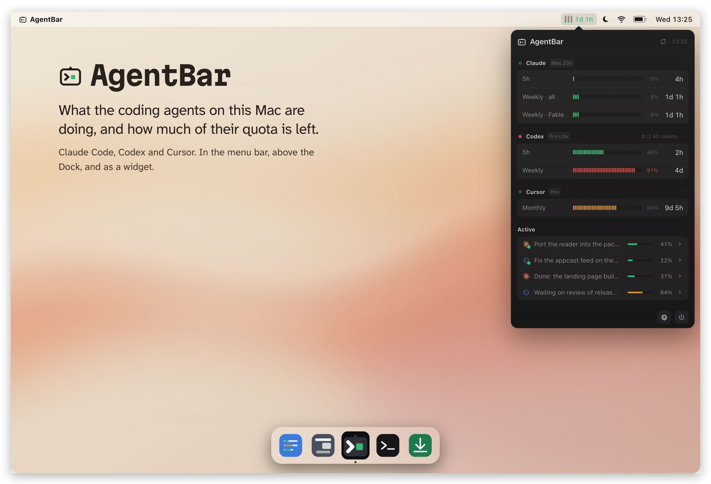
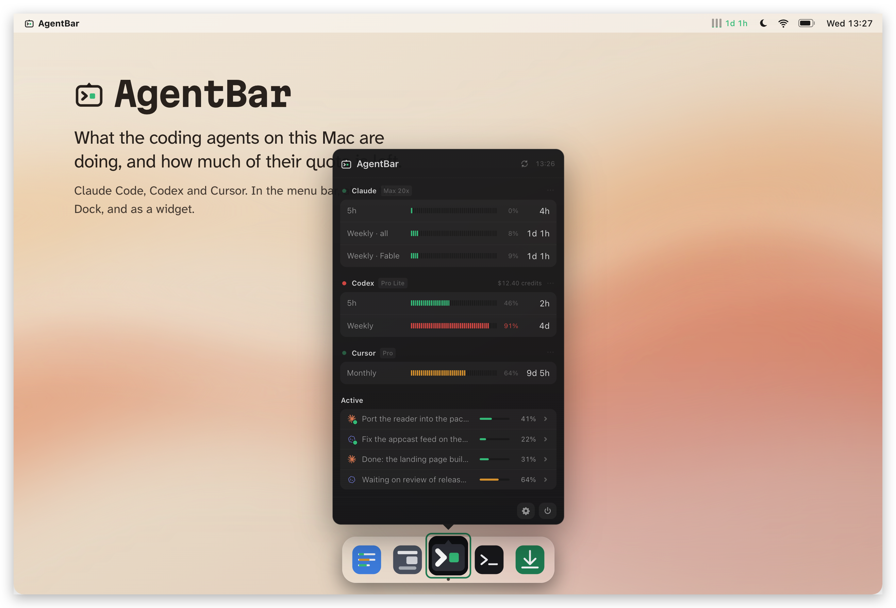
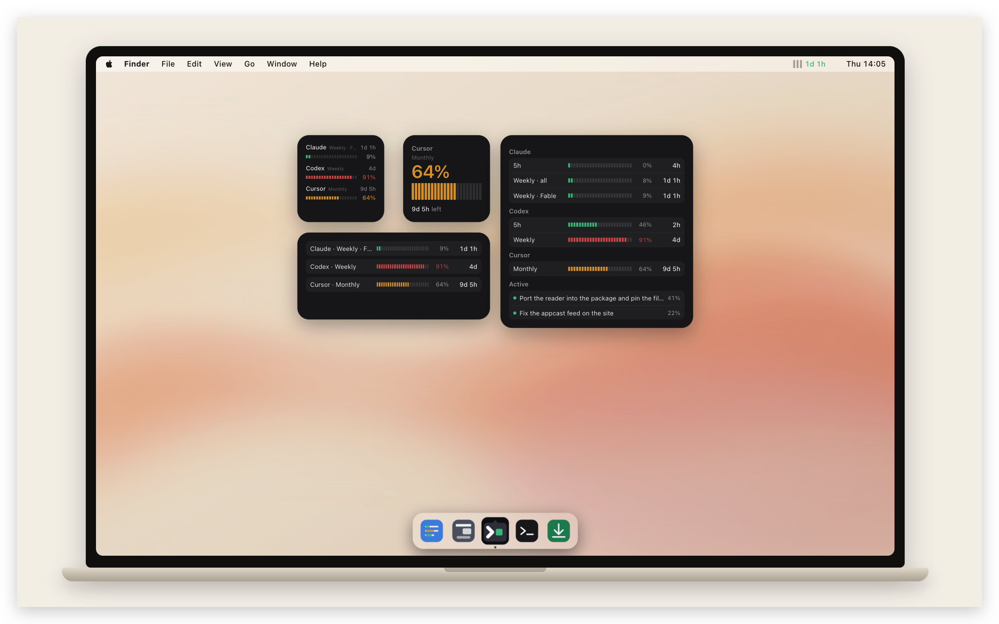
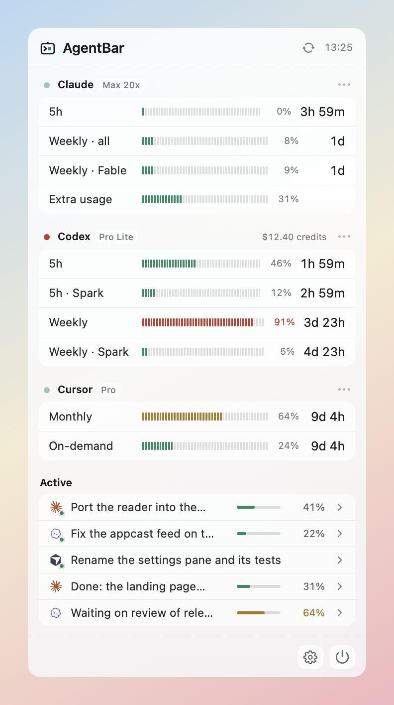
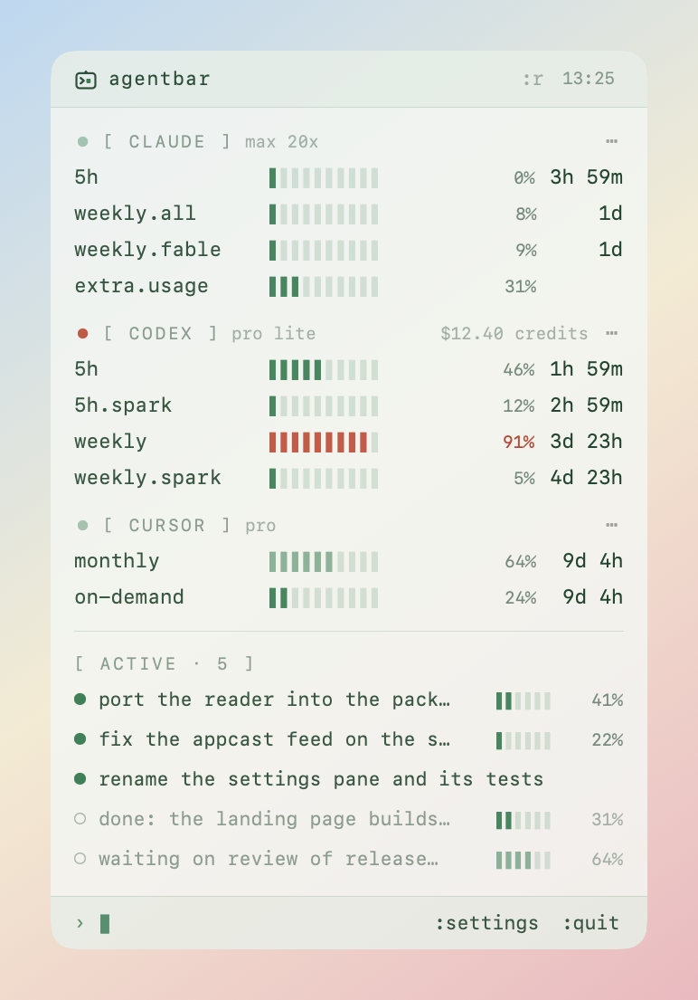
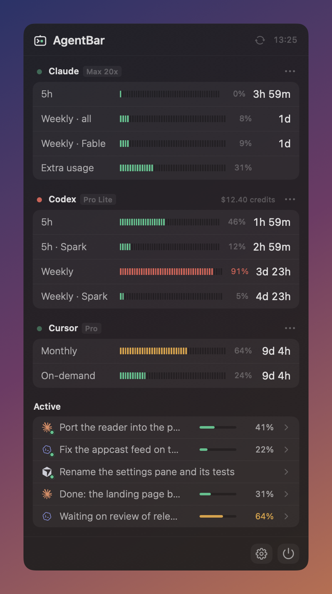
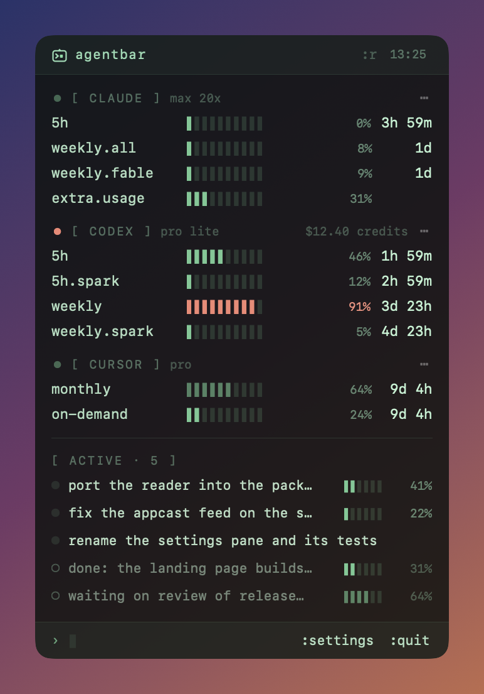
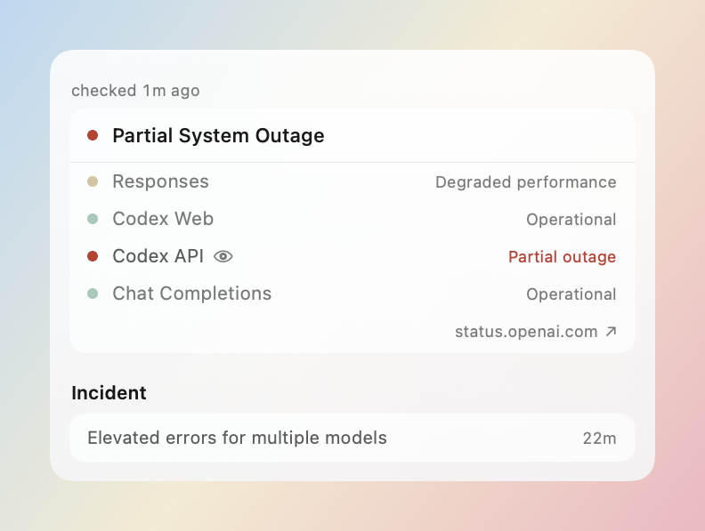
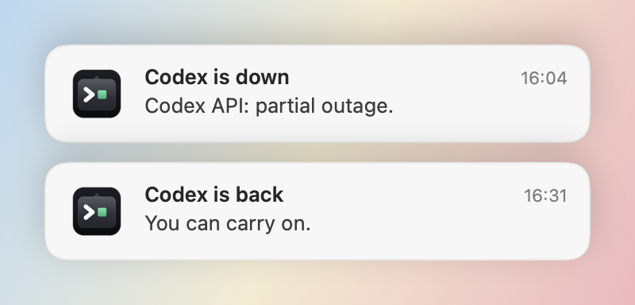

<p align="center">
  
</p>

<h1 align="center">AgentBar</h1>

<p align="center">
  What the coding agents on this Mac are doing, and how much of their quota is left:
  in the menu bar, in the Dock, and as a macOS widget.
</p>

<p align="center">
  <a href="https://agentbar.greatpixels.com"><b>agentbar.greatpixels.com</b></a>
</p>

<p align="center">
  
  
  
  
  
</p>

<p align="center">
  
</p>

Claude Code, Codex and Cursor each keep their rate-limit windows and their sessions on this Mac, in
their own files and behind their own sign-in. AgentBar reads them there and shows the answer where
you glance anyway: how much of each window is spent, how long until it starts over, and which
conversations are running right now. It also watches each agent's own status page, so you know
whether the thing that just stopped working is you or them.

## Where it lives

**The menu bar.** The symbol, or a bar per window with the time left on one of them, coloured as it
fills. A click opens the panel, as in the picture at the top; *Settings › Menu Bar* chooses which
windows the bars stand for and whose time the number is.

**The Dock.** An icon in the Dock and in ⌘-Tab if you want one. A click opens the same panel above
the icon, or a window if you prefer; ⌘0 opens that window from anywhere.

<p align="center">
  
</p>

**The widget.** Three sizes for Notification Center and the desktop. Right-click, then Edit Widget,
picks the theme, the windows to show, and whether the running conversations are listed.

<p align="center">
  
</p>

## Highlights

- **Every window, one glance.** Claude's session and weekly windows, the weekly window per model,
  Codex's five-hour and weekly windows, Cursor's monthly plan usage. Each with a meter, a
  percentage and the time until it starts over, green through amber to red as it fills.
- **The conversations that are running.** Named by what was last said in them, with a breathing dot
  while the agent works and how full the context is. Claude Code and Codex give a real percentage
  where the window size is known; Cursor's agent chats come from the editor's own transcripts.
- **In the menu bar, the Dock, and on the desktop.** A bar per window with the time left on one of
  them; an optional Dock icon that opens the same panel, or a window if you prefer (⌘0 from
  anywhere); a widget in three sizes for Notification Center and the desktop.
- **It tells you when a service is back.** A status page says something is down, and then nothing
  says it is working again. AgentBar reads the parts you actually run on, announces a change only
  once two readings agree, and never reports an unreachable page as an outage.
- **Nothing invented.** A window that has already started over shows a dash rather than a stale
  figure. A reading taken hours ago says how old it is. A context whose limit is written nowhere
  shows its tokens rather than a made-up percentage.
- **Little leaves the Mac.** Conversations are read on disk and stay there. The figures only an
  account knows are asked of that account with the sign-in it already keeps here, read-only, once
  every five minutes and on a refresh. No credential is stored, shown or logged.
- **Self-updating.** A daily check through [Sparkle](https://sparkle-project.org), EdDSA-signed
  releases, signed with a Developer ID certificate and notarized by Apple.

## Two styles

The same readings, drawn two ways: *Glass*, which sits on your desktop like the system's own
panels, and *Terminal*, which reads like the tools it watches. *Settings › General* switches
between them, and both follow the system appearance or a theme you pick.

<table>
  <tr>
    <th width="50%">Glass</th>
    <th width="50%">Terminal</th>
  </tr>
  <tr>
    <td></td>
    <td></td>
  </tr>
  <tr>
    <td></td>
    <td></td>
  </tr>
</table>

## When a service goes down

<p align="center">
  <picture>
    <source media="(prefers-color-scheme: dark)" srcset="docs/screenshots/status-dark.png">
    
  </picture>
</p>

A status page covers a whole company. Claude's covers claude.ai, the Console, Cowork and Claude
Code as separate parts; AgentBar watches the parts you actually run on and marks them with an eye,
so claude.ai going down while Claude Code keeps working is not your outage. The screen shows the
roll-up, every component, the open incident and how long it has been running.

<p align="center">
  <picture>
    <source media="(prefers-color-scheme: dark)" srcset="docs/screenshots/notifications-dark.png">
    
  </picture>
</p>

The second one is the message this feature exists for. A status page tells you a service is down,
and then nothing tells you it is working again, so you go back and try until it does. AgentBar
sends that one whether or not you asked to hear about the outage. A change is announced only once
two readings agree, a page that cannot be reached is never reported as an outage, and an outage
already under way when you open your Mac is not announced at all.

## How it knows

| Source | What it gives | What it costs |
|---|---|---|
| The agents' own files under your home folder | The windows they write and the sessions they run | Nothing leaves the Mac |
| Each agent's own sign-in, already on this Mac | The figures only the account knows, such as usage from another Mac or from while the agent was not running | One read-only request every five minutes, and one on a refresh |
| The public status pages (`status.claude.com`, `status.openai.com`, `status.cursor.com`) | Whether the service is well | No account, and nothing about you |

An agent you turn off is neither read nor asked about. Update checks and the status pages each have
a switch of their own.

## Install

Download the latest zip from [the website](https://agentbar.greatpixels.com), unzip it, drag
**AgentBar.app** to Applications and open it. It appears in the menu bar, and nothing else happens
until you click it. Builds are signed with a Developer ID certificate and notarized, and the app
updates itself.

Requires macOS 14 or later. Free.

## Development

```bash
brew install xcodegen             # once
git clone git@github.com:aliyar/AgentBar.git && cd AgentBar
make run                          # generate the Xcode project, build Debug, relaunch the app
make test                         # AgentBarKit package tests (swift test) + app tests (xcodebuild)
make screenshots                  # render the panel, status and notification pictures
make help                         # every target
```

Prerequisites: Xcode, [xcodegen](https://github.com/yonaskolb/XcodeGen), Node.js for the site. The
Xcode project is generated from `project.yml` and is not committed.
[docs/DEVELOPMENT.md](docs/DEVELOPMENT.md) has the layout and the conventions;
[docs/RELEASING.md](docs/RELEASING.md) has the release pipeline. The repository also holds the
product website in [`site/`](site/).

## Project status

Shipping. The menu bar item, the panel, the Dock window and the widget are all in, for Claude Code,
Codex and Cursor. See [CHANGELOG.md](CHANGELOG.md) for what each release brought.

## License

[MIT](LICENSE).
